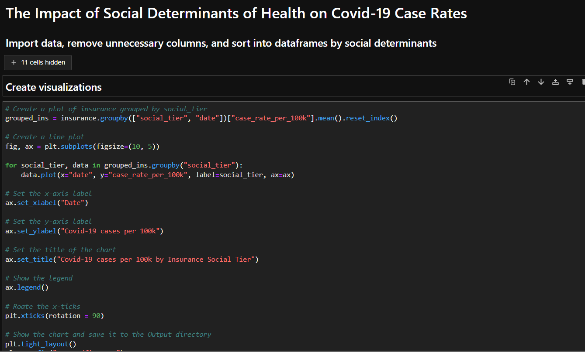

## An analysis of the impact of social determinants of health on Covid-19 case rates in California

#### Through the creation of dataframes and graphs made, we were able to analyze what the major social determinants of health were on Covid-19 Case Rates. The top one was primarily due to crowding in households which we saw repeating trends on higher case rates when there is higher percentages of crowding. We also see that the peak of Covid-19 Cases fluctuate between low income populations and high income populations and this could be due to multiple reasons but further analysis would be need to know what those are. One possibility is that for the higher income population, cases could have peaked within December to January for all three continuous years due to large social gatherings and events for the holidays, while for lower income populations, cases could have peaked due to household crowdings during the holidays and to be able to afford cheaper rent. Another factor could include working jpbs in high density public places where Covid-19 infection chances are much higher. If one person in a large household gets infected, it is much more difficult to self quarantine as well due to limited personal space in lower income social tiers.

####  With the three social determinants of health being insurance, crowding, and income, we see the line graph follows the same trends between all three determinants. For example, insurance and crowding being very similar through December of 2020 to March of 2021 exponentially increasing from 50 cases to a little under 200 cases to back down to around 50 cases around February 2021. Income did not play as big of a factor as insurance and crowding did with the numbers being about 50-60 cases less than the two while following the same trends.

####  In conclusion, we can analyze and see that these three social determinants play a huge factor within lower social tiers and its relation with chances or likelihood of Covid-19 infection rates.
---
#### Directory structure:
Project_1.ipynb  
Project 1 Slide Deck.pdf  
README.md  
Resources/  
├─ covid19case_rate_by_social_det.csv  
├─ covid-19_race_ethnicity_timeseries.csv  
Output/  
├─ fig1.png  
├─ fig2.png  
├─ fig3.png  
├─ fig4.png  
├─ fig5.png  
├─ fig6.png  
Working_Files/  
├─ Project #1 starter.ipynb  
├─ PROJ 1 ANALYSIS.ipynb  
├─ PROJ 1 ANALYSIS.md   
├─ Screenshot.png  

##### *Resources directory contains datasets, Output directory contains plots, and Working_Files directory contains misc files*
---

